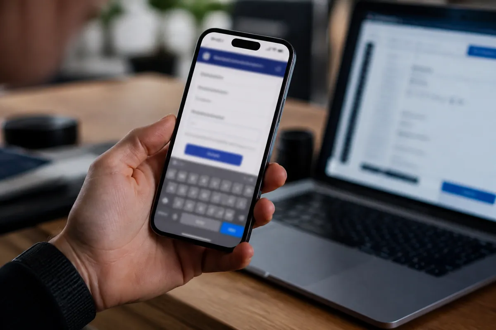

Pedir pra uma IA "criar uma landing page" é uma das tarefas mais comuns que existem, e quase todo mundo compara o resultado só olhando o topo da página. O topo é a parte que todos os modelos acertam. A diferença aparece embaixo: no formulário, na validação, na acessibilidade e no que acontece quando alguém digita um e-mail errado.

Então fizemos um teste simples. Um único prompt, quatro modelos, nenhuma edição depois. Abrimos os quatro arquivos, testamos no celular e no computador, preenchemos o formulário certo e errado, e medimos o que cada um custou.

## Como o teste foi feito

Antes dos resultados, três avisos de honestidade, porque eles mudam como você deve ler os números:

- **Rodamos pela API, não pelos apps de chat.** Isso significa que os modelos não usaram o prompt de sistema e as ferramentas de cada app, e que os planos gratuitos não entraram na conta. É um teste dos modelos, não da experiência de usar o ChatGPT, o Claude ou o Gemini no navegador.
- **Uma rodada por modelo.** Modelos de IA variam de uma execução pra outra. Um segundo teste poderia sair diferente, então trate isto como um retrato, não como um ranking definitivo.
- **O Claude precisou de uma segunda tentativa.** Na primeira, o limite de saída que definimos (16 mil tokens) cortou o arquivo no meio, e isso foi erro nosso, não do modelo. Rodamos de novo com um limite maior, e o resultado abaixo é o da segunda rodada.

O prompt foi exatamente este:

  

    
    prompt do teste
    <button class="copy-btn" data-copy-target="prompt-landing">Copiar</button>
  

  <pre id="prompt-landing"><code>Crie uma landing page completa para uma cafeteria fictícia chamada "Grão Nobre", em um único arquivo HTML com CSS e JavaScript embutidos, sem bibliotecas ou arquivos externos. A página precisa ter: cabeçalho com navegação, seção principal com chamada para ação, cardápio com pelo menos 6 itens e preços em reais, seção de depoimentos, formulário de reserva de mesa (nome, e-mail, data, número de pessoas) com validação e mensagem de confirmação, e rodapé. Deve funcionar bem no celular e no computador. Responda apenas com o código HTML.</code></pre>

Os modelos foram Claude Sonnet 5.5 (Anthropic), GPT-6 Luna (OpenAI), Gemini 3.8 Flash (Google) e DeepSeek V4.1 Flash. Escolhemos uma versão intermediária ou rápida de cada empresa, não o modelo mais caro, porque é o que a maioria das pessoas usa no dia a dia.

## O que todos fizeram igual

Antes das diferenças, vale registrar o que os quatro acertaram, porque é bastante coisa:

- Página em português do Brasil (`lang="pt-BR"`), meta viewport e nenhuma biblioteca externa, como pedido.
- Nenhuma rolagem horizontal no celular (testamos a 375 pixels de largura).
- Formulário que rejeita e-mail inválido e datas no passado, e mostra uma confirmação quando tudo está certo.
- Um tema visual quase idêntico: marrom escuro, creme e caramelo. Com o mesmo prompt, os quatro chegaram à mesma ideia de "cafeteria".

Ou seja, ninguém entregou uma página quebrada. A pergunta útil é o que muda depois disso.

## Custo, tempo e tamanho

  <table style="width:100%;border-collapse:collapse;background:#ffffff;color:#1a1a1a;box-shadow:0 1px 4px rgba(0,0,0,0.08);border-radius:8px;overflow:hidden;">
    <thead>
      <tr style="background:var(--ink-deep);color:#ffffff;">
        <th style="padding:14px 16px;text-align:left;font-size:14px;">Modelo</th>
        <th style="padding:14px 16px;text-align:left;font-size:14px;">💰 Custo</th>
        <th style="padding:14px 16px;text-align:left;font-size:14px;">⏱️ Tempo</th>
        <th style="padding:14px 16px;text-align:left;font-size:14px;">📄 Tokens de saída</th>
      </tr>
    </thead>
    <tbody>
      <tr style="border-bottom:1px solid #eee;">
        <td style="padding:12px 16px;font-weight:600;">Claude Sonnet 5.5</td>
        <td style="padding:12px 16px;">US$ 0,170</td>
        <td style="padding:12px 16px;">96 s</td>
        <td style="padding:12px 16px;">16.927</td>
      </tr>
      <tr style="border-bottom:1px solid #eee;background:#fafafa;">
        <td style="padding:12px 16px;font-weight:600;">GPT-6 Luna</td>
        <td style="padding:12px 16px;">US$ 0,005</td>
        <td style="padding:12px 16px;">56 s</td>
        <td style="padding:12px 16px;">9.526</td>
      </tr>
      <tr style="border-bottom:1px solid #eee;">
        <td style="padding:12px 16px;font-weight:600;">Gemini 3.8 Flash</td>
        <td style="padding:12px 16px;">US$ 0,042</td>
        <td style="padding:12px 16px;">62 s</td>
        <td style="padding:12px 16px;">11.219</td>
      </tr>
      <tr style="background:#fafafa;">
        <td style="padding:12px 16px;font-weight:600;">DeepSeek V4.1 Flash</td>
        <td style="padding:12px 16px;">US$ 0,009</td>
        <td style="padding:12px 16px;">46 s</td>
        <td style="padding:12px 16px;">12.370</td>
      </tr>
    </tbody>
  </table>

O custo foi o que mais destoou. O GPT-6 Luna gerou a página inteira por meio centavo de dólar. O Claude custou 35 vezes mais pela mesma tarefa, e o Gemini, 9 vezes mais que o Luna. Os arquivos finais ficaram todos entre 31 e 34 KB, então o preço maior não comprou uma página maior. Comprou outra coisa, que aparece nos testes abaixo.

## O formulário: onde os quatro se separam

Preenchemos o formulário vazio, com e-mail inválido, com data no passado e, por fim, com dados corretos.

- **Claude:** mostra uma mensagem de erro por campo ("Informe seu nome.", "Escolha a data da reserva."), marca os campos com `aria-invalid` e, na confirmação, esconde o formulário e mostra "Reserva confirmada".
- **Gemini:** também valida campo por campo, com as mensagens mais detalhadas das quatro ("Insira um e-mail válido (ex: nome@dominio.com)", "Selecione uma data a partir de hoje").
- **DeepSeek:** validação própria com uma mensagem por campo, e uma confirmação que repete o número de pessoas, a data e o e-mail digitado.
- **GPT-6 Luna:** usa só a validação nativa do navegador. Funciona, e rejeitou e-mail inválido e data passada, mas não escreve nenhuma mensagem própria, então o texto do erro depende do navegador e do idioma dele.

Nenhuma dessas escolhas está errada. Mas o Luna entregou a validação mais simples, e isso combina com o custo dele: o que foi economizado em tokens apareceu em acabamento.

## Acessibilidade: a diferença mais escondida

Aqui as quatro páginas ficaram mais distantes, e é o tipo de coisa que quase ninguém confere olhando a tela.

  <table style="width:100%;border-collapse:collapse;background:#ffffff;color:#1a1a1a;box-shadow:0 1px 4px rgba(0,0,0,0.08);border-radius:8px;overflow:hidden;">
    <thead>
      <tr style="background:var(--ink-deep);color:#ffffff;">
        <th style="padding:14px 16px;text-align:left;font-size:14px;">Recurso</th>
        <th style="padding:14px 16px;text-align:left;font-size:14px;">Claude</th>
        <th style="padding:14px 16px;text-align:left;font-size:14px;">Luna</th>
        <th style="padding:14px 16px;text-align:left;font-size:14px;">Gemini</th>
        <th style="padding:14px 16px;text-align:left;font-size:14px;">DeepSeek</th>
      </tr>
    </thead>
    <tbody>
      <tr style="border-bottom:1px solid #eee;">
        <td style="padding:12px 16px;font-weight:600;">Link "pular para o conteúdo"</td>
        <td style="padding:12px 16px;">Sim</td>
        <td style="padding:12px 16px;">Não</td>
        <td style="padding:12px 16px;">Não</td>
        <td style="padding:12px 16px;">Não</td>
      </tr>
      <tr style="border-bottom:1px solid #eee;background:#fafafa;">
        <td style="padding:12px 16px;font-weight:600;">Campos marcados com aria-invalid</td>
        <td style="padding:12px 16px;">Sim</td>
        <td style="padding:12px 16px;">Não</td>
        <td style="padding:12px 16px;">Não</td>
        <td style="padding:12px 16px;">Sim</td>
      </tr>
      <tr style="border-bottom:1px solid #eee;">
        <td style="padding:12px 16px;font-weight:600;">Menu do celular com aria-expanded</td>
        <td style="padding:12px 16px;">Sim</td>
        <td style="padding:12px 16px;">Sim</td>
        <td style="padding:12px 16px;">Não</td>
        <td style="padding:12px 16px;">Sim</td>
      </tr>
      <tr style="border-bottom:1px solid #eee;background:#fafafa;">
        <td style="padding:12px 16px;font-weight:600;">Respeita prefers-reduced-motion</td>
        <td style="padding:12px 16px;">Sim</td>
        <td style="padding:12px 16px;">Sim</td>
        <td style="padding:12px 16px;">Não</td>
        <td style="padding:12px 16px;">Sim</td>
      </tr>
      <tr>
        <td style="padding:12px 16px;font-weight:600;">Atributos aria no código (contagem)</td>
        <td style="padding:12px 16px;">50</td>
        <td style="padding:12px 16px;">32</td>
        <td style="padding:12px 16px;">6</td>
        <td style="padding:12px 16px;">44</td>
      </tr>
    </tbody>
  </table>

O Claude foi o único a incluir o link de pular navegação, e junto com o DeepSeek foi o que marcou os campos com erro pra leitores de tela. O Gemini foi o mais enxuto: cerca de seis atributos de acessibilidade no arquivo inteiro, o botão de menu sem indicar se está aberto ou fechado, e nenhuma preocupação com quem desativa animações no sistema. A contagem de atributos é uma medida grosseira, e o número maior não garante uma página melhor, mas a diferença de 50 pra 6 se confirma nos itens individuais da tabela.

Essa é a lição que o teste deixa: a página do Gemini parece tão boa quanto a das outras quando você olha, e é exatamente por isso que a diferença passa despercebida.

## O visual: uma diferença menor do que parece

Olhando as quatro páginas abertas, as diferenças visuais são pequenas e de gosto.

- **Claude e GPT-6 Luna** desenharam uma xícara ilustrada na seção principal, usando só CSS e SVG. É o que dá mais cara de "site de verdade".
- **DeepSeek** usou um círculo com uma xícara pequena, mais simples.
- **Gemini** deixou a seção principal só com texto, sem nenhuma ilustração. Limpa, mas a mais genérica das quatro.

Sobre o cardápio: o pedido era "pelo menos 6 itens". O Luna entregou exatamente 6, o Gemini 7, o DeepSeek 8 e o Claude 9 preços. Todos cumpriram o pedido, e os números só indicam quanto cada um se esforçou além do mínimo.

## Qual escolher pra esse tipo de tarefa

Não existe um vencedor único, e sim um trade-off claro entre custo e acabamento:

- **Se acessibilidade e cuidado com detalhes importam** (site de cliente, produto real): o Claude entregou a página mais completa, ao custo de 35 vezes o do mais barato.
- **Se você vai iterar dezenas de vezes e só precisa de um rascunho funcional:** o GPT-6 Luna ou o DeepSeek resolvem por centavos, e você refina depois.
- **Se você usa o Gemini:** não é um problema de qualidade visual, é de acabamento invisível. Peça explicitamente acessibilidade no prompt, como link de pular navegação, `aria-expanded` no menu e suporte a movimento reduzido.

Esse último ponto vale pra todos. Nenhum modelo recebeu o pedido "faça acessível", e o resultado mostra o que cada um faz por conta própria. Com uma linha a mais no prompt, a distância provavelmente diminui.

## Perguntas Frequentes

### Qual IA cria a melhor landing page?

Depende do que "melhor" significa. Neste teste, o Claude entregou a página mais completa em validação e acessibilidade, o GPT-6 Luna foi o mais barato, e os quatro chegaram a páginas funcionais e parecidas no visual. O teste foi de uma rodada por modelo, então o resultado pode variar.

### Quanto custa gerar uma landing page com IA pela API?

Neste teste, de meio centavo (GPT-6 Luna) a 17 centavos de dólar (Claude Sonnet 5.5) por página. O custo depende do modelo e de quanto ele escreve, e não do tamanho final do arquivo, já que os quatro ficaram entre 31 e 34 KB.

### Esse teste vale pros planos gratuitos do ChatGPT, Claude e Gemini?

Não diretamente. Rodamos os modelos pela API, sem o prompt de sistema e as ferramentas dos apps de chat, então a experiência de usar cada um no navegador pode diferir.

### As páginas geradas por IA são acessíveis?

Só em parte, e varia muito entre modelos. Neste teste, uma página tinha cerca de 50 atributos de acessibilidade e link de pular navegação, e outra tinha por volta de 6. Sempre vale pedir acessibilidade no prompt e revisar o resultado.

### Dá pra usar o código gerado direto em produção?

Como ponto de partida, sim: todas funcionaram no celular e no computador. Mas o formulário de reserva não envia dados a lugar nenhum, só mostra a confirmação na tela, então precisa de um backend antes de ir pro ar.

## Conclusão

Com o mesmo prompt, os quatro modelos entregaram uma página funcional e bonita, o que já é um resultado notável. O que os separa não está no que você vê ao abrir o arquivo, está no que só aparece quando você mexe no formulário ou navega pelo teclado: validação com mensagens próprias, link de pular navegação, menu que avisa se está aberto. Esse acabamento custou de 9 a 35 vezes mais que o Luna, e nem sempre compensa. Se o objetivo é um rascunho, o mais barato resolve. Se o objetivo é entregar pra um cliente, vale pagar mais ou, melhor ainda, escrever no prompt exatamente o que você espera de acessibilidade e conferir o resultado.

## Leia Também

- [DeepSeek vs ChatGPT: o mesmo prompt de timer Pomodoro](/deepseek-vs-chatgpt-timer-pomodoro/)
- [API do Grok vs GPT-6 Astra e Claude Opus 5: as contas](/grok-api-preco/)
- [Vibe coding sem bagunça: 6 hábitos](/vibe-coding-6-habitos-sem-bagunca/)

---

*Fontes: teste próprio, realizado em 28 de setembro de 2026 pela API do OpenRouter, com uma execução por modelo. Custos e tokens retornados pela própria API. Prompt reproduzido integralmente acima.*
